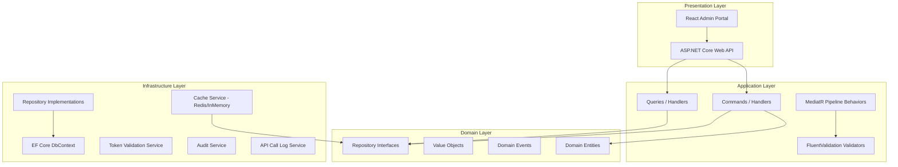
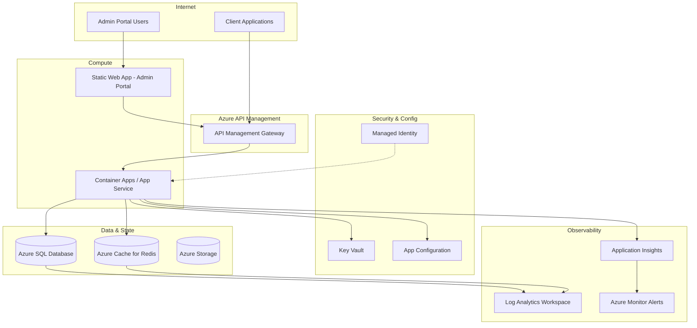
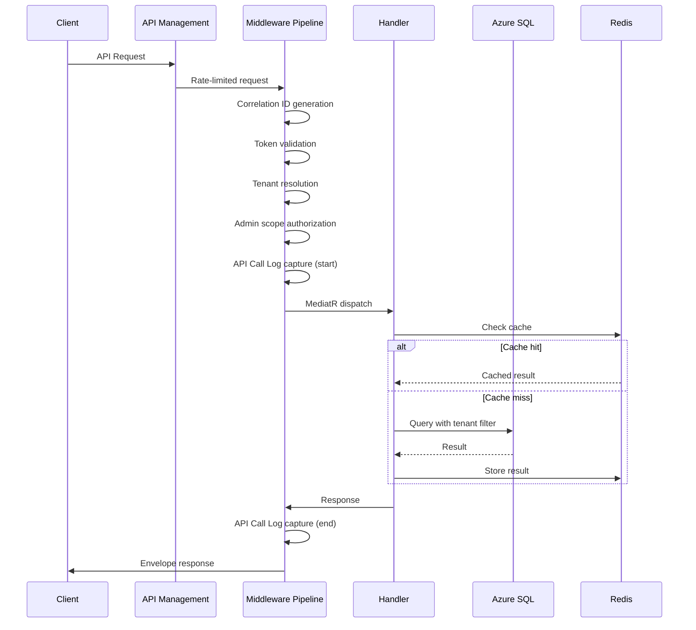
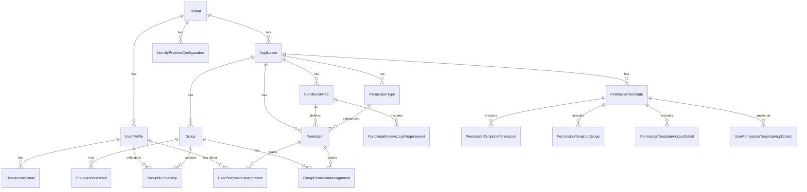
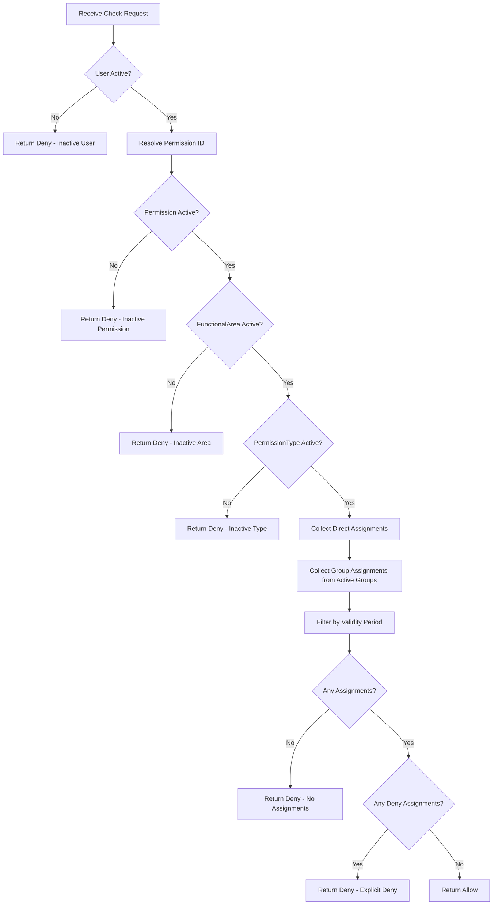
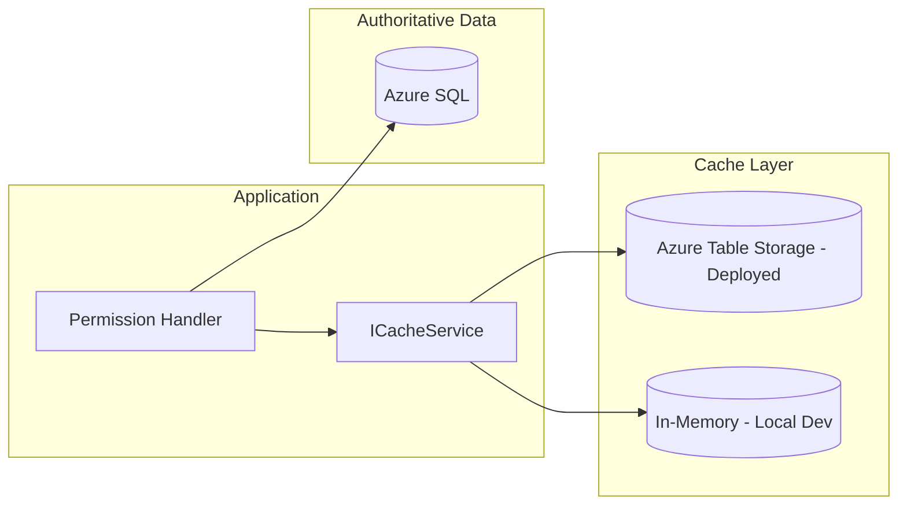
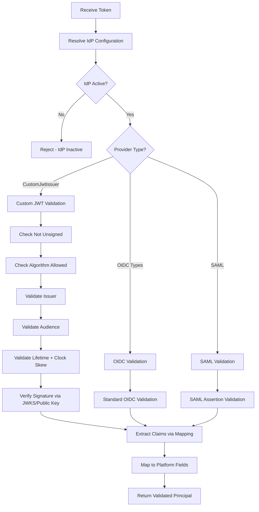
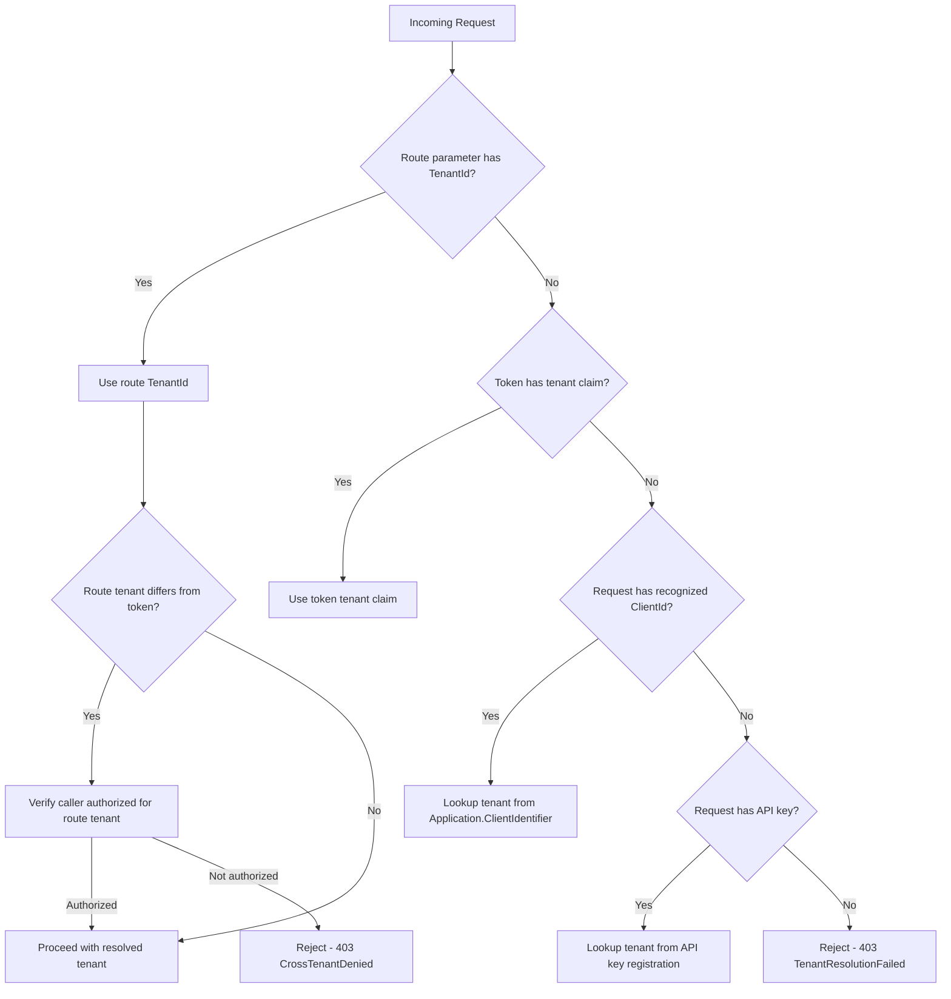
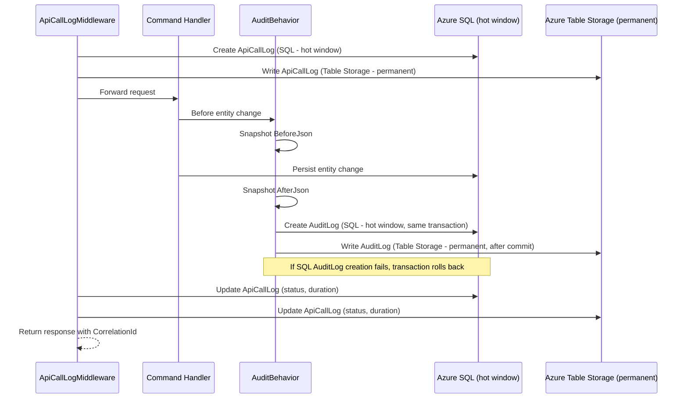

# Design Document: Heimdall Access

## Overview

Heimdall Access is a production-ready, Azure-native, multi-tenant security and access management platform. It provides identity federation, fine-grained permission management, data-level access filtering via access details, permission templates for standardized provisioning, and comprehensive audit logging. The platform delegates authentication to trusted external identity providers and delivers authorization services to implementer applications via a REST API.

### Key Design Goals

- **Multi-tenant isolation**: Complete data separation at the database layer using EF Core global query filters
- **Extensible authorization model**: Implementer-defined permission types, functional areas, and access detail types without hardcoded enums
- **Performance**: Sub-100ms cached permission checks, sub-300ms uncached, with Redis-backed caching and targeted invalidation
- **Auditability**: Immutable API call logs and audit logs with full before/after state capture and correlation
- **Security**: Defense-in-depth with Managed Identity, Key Vault, TLS 1.2+, parameterized queries, and rate limiting
- **Developer experience**: Local Docker Compose environment, EF Core migrations, Swagger UI, seed data

### Technology Stack

| Layer | Technology |
|-------|-----------|
| Backend | .NET 8+, C#, ASP.NET Core Web API |
| Architecture | Clean Architecture (Domain, Application, Infrastructure, API) |
| ORM | Entity Framework Core 8+ |
| Database | Azure SQL Database |
| Permission Cache | Azure Table Storage (write-through) / In-Memory (local) |
| Logs & Audit | Azure Table Storage (long-term) + Azure SQL (30-day hot window) |
| Frontend | React 18+, TypeScript, Vite, Tailwind CSS |
| Auth (Portal) | MSAL.js (@azure/msal-react) |
| IaC | Bicep |
| CI/CD | GitHub Actions |
| Identity | Azure Entra External ID + configurable providers |
| API Gateway | Azure API Management |
| Compute | Azure Container Apps (production) / App Service (dev/staging) |
| Secrets | Azure Key Vault |
| Config | Azure App Configuration |
| Monitoring | Application Insights + Log Analytics Workspace |

---

## Architecture

### Clean Architecture Layers



### Azure Deployment Topology



### Request Processing Pipeline



### Project Structure

```
src/
├── Heimdall.Domain/                  # Domain layer
│   ├── Entities/
│   ├── ValueObjects/
│   ├── Enums/
│   ├── Events/
│   └── Interfaces/
├── Heimdall.Application/             # Application layer
│   ├── Common/
│   │   ├── Behaviors/
│   │   ├── Interfaces/
│   │   └── Models/
│   ├── Tenants/
│   ├── Applications/
│   ├── IdentityProviders/
│   ├── Users/
│   ├── FunctionalAreas/
│   ├── PermissionTypes/
│   ├── Permissions/
│   ├── Groups/
│   ├── PermissionAssignments/
│   ├── AccessDetails/
│   ├── PermissionTemplates/
│   ├── PermissionResolution/
│   └── AuditLogs/
├── Heimdall.Infrastructure/          # Infrastructure layer
│   ├── Persistence/
│   │   ├── Configurations/           # EF Core entity configs
│   │   ├── Migrations/
│   │   └── HeimdallDbContext.cs
│   ├── Caching/
│   ├── Identity/
│   ├── Logging/
│   └── Services/
├── Heimdall.Api/                     # Presentation layer
│   ├── Controllers/
│   ├── Middleware/
│   ├── Filters/
│   └── Program.cs
├── Heimdall.AdminPortal/             # React frontend
│   ├── src/
│   │   ├── components/
│   │   ├── pages/
│   │   ├── services/
│   │   ├── hooks/
│   │   └── auth/
│   └── vite.config.ts
└── tests/
    ├── Heimdall.Domain.Tests/
    ├── Heimdall.Application.Tests/
    ├── Heimdall.Infrastructure.Tests/
    ├── Heimdall.Api.IntegrationTests/
    └── Heimdall.Api.SecurityTests/
```

---

## Components and Interfaces

### Domain Layer Interfaces

```csharp
// Core repository pattern
public interface IRepository<T> where T : BaseEntity
{
    Task<T?> GetByIdAsync(Guid id, CancellationToken ct = default);
    Task<IReadOnlyList<T>> GetAllAsync(CancellationToken ct = default);
    Task<T> AddAsync(T entity, CancellationToken ct = default);
    Task UpdateAsync(T entity, CancellationToken ct = default);
}

// Tenant context for automatic filtering
public interface ITenantContext
{
    Guid TenantId { get; }
    Guid? ApplicationId { get; }
    string ActorSubjectId { get; }
    string ActorEmail { get; }
    Guid? ActorUserProfileId { get; }
    IReadOnlyList<string> AdminScopes { get; }
    bool IsSuperAdmin { get; }
}

// Permission resolution engine
public interface IPermissionResolver
{
    Task<PermissionCheckResult> CheckPermissionAsync(
        Guid tenantId, Guid applicationId, Guid userProfileId,
        string functionalAreaCode, string permissionTypeCode,
        DateTime? evaluationTime = null, CancellationToken ct = default);

    Task<PermissionCheckResult> CheckPermissionByCodeAsync(
        Guid tenantId, Guid applicationId, Guid userProfileId,
        string permissionCode, DateTime? evaluationTime = null,
        CancellationToken ct = default);

    Task<PermissionCheckResult> CheckPermissionByExternalIdAsync(
        Guid tenantId, Guid applicationId,
        string externalSubjectId, string identityProvider,
        string permissionCode, DateTime? evaluationTime = null,
        CancellationToken ct = default);

    Task<BatchPermissionCheckResult> CheckBatchAsync(
        Guid tenantId, Guid applicationId, Guid userProfileId,
        IReadOnlyList<PermissionCheckRequest> checks,
        DateTime? evaluationTime = null, CancellationToken ct = default);

    Task<EffectivePermissionsResult> GetEffectivePermissionsAsync(
        Guid tenantId, Guid applicationId, Guid userProfileId,
        DateTime? evaluationTime = null, CancellationToken ct = default);
}

// Access detail resolution
public interface IAccessDetailResolver
{
    Task<AccessDetailLookupResult> GetAccessDetailsAsync(
        Guid tenantId, Guid applicationId, Guid userProfileId,
        string functionalAreaCode, DateTime? evaluationTime = null,
        CancellationToken ct = default);
}

// Cache abstraction (backed by Azure Table Storage in production)
public interface ICacheService
{
    Task<T?> GetSnapshotAsync<T>(string partitionKey, string rowKey, CancellationToken ct = default);
    Task SetSnapshotAsync<T>(string partitionKey, string rowKey, T value, CancellationToken ct = default);
    Task DeleteSnapshotAsync(string partitionKey, string rowKey, CancellationToken ct = default);
    Task RecomputePermissionSnapshotAsync(Guid tenantId, Guid applicationId, Guid userProfileId, CancellationToken ct = default);
    Task RecomputeAccessDetailSnapshotAsync(Guid tenantId, Guid applicationId, Guid userProfileId, string functionalAreaCode, CancellationToken ct = default);
}

// Audit service
public interface IAuditService
{
    Task RecordAsync(AuditEntry entry, CancellationToken ct = default);
}

// Token validation
public interface ITokenValidationService
{
    Task<TokenValidationResult> ValidateTokenAsync(
        string token, Guid tenantId, Guid? applicationId = null,
        CancellationToken ct = default);
}

// API call logging
public interface IApiCallLogService
{
    Task<Guid> BeginLogAsync(ApiCallLogEntry entry, CancellationToken ct = default);
    Task CompleteLogAsync(Guid apiCallLogId, int statusCode, long durationMs, CancellationToken ct = default);
}

// Template service
public interface ITemplateApplicationService
{
    Task<TemplateApplicationResult> ApplyTemplateAsync(
        Guid tenantId, Guid applicationId, Guid userProfileId,
        Guid permissionTemplateId, TemplateApplicationOptions options,
        CancellationToken ct = default);

    Task<TemplatePreviewResult> PreviewTemplateAsync(
        Guid tenantId, Guid applicationId, Guid userProfileId,
        Guid permissionTemplateId, TemplateApplicationOptions options,
        CancellationToken ct = default);
}

// Product configuration
public interface IProductConfiguration
{
    string GetDisplayName(); // Returns configured name or "Heimdall Access"
}
```

### MediatR Pipeline Behaviors

```csharp
// Validation behavior - runs FluentValidation before handler
public class ValidationBehavior<TRequest, TResponse> : IPipelineBehavior<TRequest, TResponse>

// Audit behavior - captures before/after state for commands
public class AuditBehavior<TRequest, TResponse> : IPipelineBehavior<TRequest, TResponse>

// Cache write-through behavior - recomputes Table Storage snapshots after mutations
public class CacheWriteThroughBehavior<TRequest, TResponse> : IPipelineBehavior<TRequest, TResponse>

// Performance logging behavior - logs slow queries
public class PerformanceLogBehavior<TRequest, TResponse> : IPipelineBehavior<TRequest, TResponse>
```

### Middleware Pipeline (Order)

1. **ExceptionHandlingMiddleware** — Global exception to envelope conversion
2. **CorrelationIdMiddleware** — Generate/propagate unique UUID v4 correlation ID
3. **ApiCallLogMiddleware** — Capture request start, write log on response
4. **TokenValidationMiddleware** — Validate bearer token / API key
5. **TenantResolutionMiddleware** — Resolve tenant from route > token > client > key
6. **AdminAuthorizationMiddleware** — Verify required admin scopes

### API Controllers

| Controller | Responsibility | Key Endpoints |
|-----------|---------------|---------------|
| TenantsController | Tenant CRUD | POST, GET, PUT, DELETE /api/tenants |
| ApplicationsController | App CRUD per tenant | POST, GET, PUT, DELETE /api/tenants/{tenantId}/applications |
| IdentityProvidersController | IdP configuration | POST, GET, PUT, DELETE /api/tenants/{tenantId}/identity-providers |
| UsersController | User sync and management | POST, GET, PUT /api/tenants/{tenantId}/users |
| FunctionalAreasController | Functional area CRUD | POST, GET, PUT, DELETE /api/tenants/{tenantId}/applications/{appId}/functional-areas |
| PermissionTypesController | Permission type CRUD | POST, GET, PUT, DELETE /api/tenants/{tenantId}/applications/{appId}/permission-types |
| PermissionsController | Permission CRUD | POST, GET, PUT, DELETE /api/tenants/{tenantId}/applications/{appId}/permissions |
| GroupsController | Group CRUD + membership | POST, GET, PUT, DELETE /api/tenants/{tenantId}/applications/{appId}/groups |
| PermissionAssignmentsController | Assign permissions | POST, GET, DELETE /api/tenants/{tenantId}/applications/{appId}/permission-assignments |
| AccessDetailsController | User & group access details | POST, GET, PUT, DELETE /api/tenants/{tenantId}/applications/{appId}/access-details |
| PermissionTemplatesController | Template CRUD + apply | POST, GET, PUT, DELETE, POST apply /api/tenants/{tenantId}/applications/{appId}/permission-templates |
| AccessChecksController | Permission resolution | POST /api/tenants/{tenantId}/applications/{appId}/access-checks |
| AuditLogsController | Query audit logs | GET /api/tenants/{tenantId}/audit-logs |
| ApiCallLogsController | Query API call logs | GET /api/tenants/{tenantId}/api-call-logs |
| HealthController | Health checks | GET /health |

---

## Data Models

### Entity Relationship Diagram



### Domain Entities

#### Base Entity

```csharp
public abstract class BaseEntity
{
    public Guid Id { get; protected set; }
    public DateTime CreatedAt { get; set; }
    public string CreatedBy { get; set; } = string.Empty;
    public DateTime? ModifiedAt { get; set; }
    public string? ModifiedBy { get; set; }
}

public abstract class TenantScopedEntity : BaseEntity
{
    public Guid TenantId { get; set; }
}

public abstract class ApplicationScopedEntity : TenantScopedEntity
{
    public Guid ApplicationId { get; set; }
}
```

#### Core Entities

```csharp
public class Tenant : BaseEntity
{
    public string Name { get; set; }              // max 128
    public string Slug { get; set; }              // max 64, globally unique
    public PrimaryIdentityMode PrimaryIdentityMode { get; set; }
    public TenantStatus Status { get; set; }      // Active, Suspended, Inactive
}

public class Application : TenantScopedEntity
{
    public string Name { get; set; }              // max 200
    public string? Description { get; set; }      // max 1000
    public string ClientIdentifier { get; set; }  // max 128, unique per tenant
    public List<string> AllowedRedirectUris { get; set; } = new(); // max 20 entries
    public List<string> AllowedOrigins { get; set; } = new();      // max 20 entries
    public ApplicationStatus Status { get; set; } // Active, Inactive
}

public class IdentityProviderConfiguration : TenantScopedEntity
{
    public Guid? ApplicationId { get; set; }
    public ProviderType ProviderType { get; set; }
    public string Name { get; set; }
    public string Issuer { get; set; }
    public string? Audience { get; set; }
    public string? ClientId { get; set; }
    public string? JwksEndpoint { get; set; }
    public string? SamlMetadataUrl { get; set; }
    public List<string> AllowedAlgorithms { get; set; } = new();
    public List<ClaimMapping> ClaimMappings { get; set; } = new();
    public int ClockSkewToleranceSeconds { get; set; } = 300; // 0-600
    public IdpStatus Status { get; set; }
}

public class UserProfile : TenantScopedEntity
{
    public string ExternalSubjectId { get; set; }
    public string IdentityProvider { get; set; }
    public string Email { get; set; }
    public string DisplayName { get; set; }
    public UserStatus Status { get; set; }        // Active, Inactive
    public DateTime? LastLoginAt { get; set; }
}

public class FunctionalArea : ApplicationScopedEntity
{
    public string FunctionalAreaCode { get; set; }  // max 50, uppercase alphanum + underscore
    public string Name { get; set; }                // max 200
    public string? Description { get; set; }        // max 1000
    public bool IsActive { get; set; } = true;
}

public class PermissionType : ApplicationScopedEntity
{
    public string Code { get; set; }              // max 100, case-insensitive unique
    public string Name { get; set; }              // max 200
    public string? Description { get; set; }      // max 1000
    public bool IsSystemReserved { get; set; }
    public bool IsActive { get; set; } = true;
}

public class Permission : ApplicationScopedEntity
{
    public Guid FunctionalAreaId { get; set; }
    public Guid PermissionTypeId { get; set; }
    public string PermissionCode { get; set; }    // max 200, uppercase
    public string Name { get; set; }
    public string? Description { get; set; }
    public bool IsActive { get; set; } = true;
}

public class Group : ApplicationScopedEntity
{
    public string Name { get; set; }              // unique per application
    public string? Description { get; set; }
    public bool IsActive { get; set; } = true;
}

public class GroupMembership : ApplicationScopedEntity
{
    public Guid GroupId { get; set; }
    public Guid UserProfileId { get; set; }
}

public class UserPermissionAssignment : ApplicationScopedEntity
{
    public Guid UserProfileId { get; set; }
    public Guid PermissionId { get; set; }
    public Effect Effect { get; set; }            // Allow, Deny
    public DateTime? ValidFrom { get; set; }
    public DateTime? ValidTo { get; set; }
}

public class GroupPermissionAssignment : ApplicationScopedEntity
{
    public Guid GroupId { get; set; }
    public Guid PermissionId { get; set; }
    public Effect Effect { get; set; }
    public DateTime? ValidFrom { get; set; }
    public DateTime? ValidTo { get; set; }
}

public class UserAccessDetail : ApplicationScopedEntity
{
    public Guid UserProfileId { get; set; }
    public string AccessDetailType { get; set; }
    public string AccessDetailCode { get; set; }
    public string AccessDetailValue { get; set; }   // max 500
    public string? Description { get; set; }        // max 1000
    public bool IsActive { get; set; } = true;
    public DateTime? ValidFrom { get; set; }
    public DateTime? ValidTo { get; set; }
}

public class GroupAccessDetail : ApplicationScopedEntity
{
    public Guid GroupId { get; set; }
    public string AccessDetailType { get; set; }
    public string AccessDetailCode { get; set; }
    public string AccessDetailValue { get; set; }   // max 500
    public string? Description { get; set; }        // max 1000
    public bool IsActive { get; set; } = true;
    public DateTime? ValidFrom { get; set; }
    public DateTime? ValidTo { get; set; }
}

public class FunctionalAreaAccessRequirement : ApplicationScopedEntity
{
    public Guid FunctionalAreaId { get; set; }
    public string AccessDetailType { get; set; }
    public bool IsRequired { get; set; }
    public string? Description { get; set; }        // max 500
    public bool IsActive { get; set; } = true;
}

public class PermissionTemplate : ApplicationScopedEntity
{
    public string TemplateCode { get; set; }
    public string Name { get; set; }
    public string? Description { get; set; }
    public bool IsActive { get; set; } = true;
}

public class PermissionTemplatePermission : BaseEntity
{
    public Guid PermissionTemplateId { get; set; }
    public Guid PermissionId { get; set; }
    public Effect Effect { get; set; }
    public int? ValidFromOffsetDays { get; set; }
    public int? ValidToOffsetDays { get; set; }
}

public class PermissionTemplateGroup : BaseEntity
{
    public Guid PermissionTemplateId { get; set; }
    public Guid GroupId { get; set; }
}

public class PermissionTemplateAccessDetail : BaseEntity
{
    public Guid PermissionTemplateId { get; set; }
    public string AccessDetailType { get; set; }
    public string AccessDetailCode { get; set; }
    public string AccessDetailValue { get; set; }
    public string? Description { get; set; }
    public int? ValidFromOffsetDays { get; set; }
    public int? ValidToOffsetDays { get; set; }
}

public class UserPermissionTemplateApplication : TenantScopedEntity
{
    public Guid ApplicationId { get; set; }
    public Guid UserProfileId { get; set; }
    public Guid PermissionTemplateId { get; set; }
    public DateTime AppliedAt { get; set; }
    public string AppliedBy { get; set; }
    public string? SourceIp { get; set; }
    public string? UserAgent { get; set; }
    public Guid CorrelationId { get; set; }
    public Guid? ApiCallLogId { get; set; }
}

public class ApiCallLog : TenantScopedEntity
{
    public Guid? ApplicationId { get; set; }
    public Guid CorrelationId { get; set; }
    public string RequestId { get; set; }
    public string HttpMethod { get; set; }
    public string Endpoint { get; set; }
    public string RequestPath { get; set; }
    public string? CallerSubjectId { get; set; }
    public string? CallerClientId { get; set; }
    public string? SourceIp { get; set; }
    public string? UserAgent { get; set; }
    public int StatusCode { get; set; }
    public long DurationMs { get; set; }
    public DateTime RequestTimestamp { get; set; }
    public DateTime ResponseTimestamp { get; set; }
}

public class AuditLog : TenantScopedEntity
{
    public Guid? ApplicationId { get; set; }
    public Guid CorrelationId { get; set; }
    public Guid? ApiCallLogId { get; set; }
    public Guid? ActorUserProfileId { get; set; }
    public string? ActorSubjectId { get; set; }
    public string? ActorEmail { get; set; }
    public string EntityType { get; set; }
    public string EntityId { get; set; }
    public string Action { get; set; }
    public string? BeforeJson { get; set; }
    public string? AfterJson { get; set; }
    public string? ChangedFieldsJson { get; set; }
    public string? SourceIp { get; set; }
    public string? UserAgent { get; set; }
}
```

### Value Objects and Enums

```csharp
public enum TenantStatus { Active, Suspended, Inactive }
public enum ApplicationStatus { Active, Inactive }
public enum UserStatus { Active, Inactive }
public enum IdpStatus { Active, Inactive }
public enum Effect { Allow, Deny }
public enum PrimaryIdentityMode { EntraExternalId, AzureAdB2C, EntraWorkforce, ExternalOidc, ExternalSaml }
public enum ProviderType
{
    EntraExternalId, AzureAdB2C, EntraWorkforce,
    Google, Facebook, ExternalOidc, ExternalSaml, CustomJwtIssuer
}
public enum AdminScope
{
    SecurityServiceAdmin, TenantAdmin, ApplicationAdmin,
    IdentityProviderAdmin, PermissionManager, TemplateManager,
    AccessDetailManager, Auditor, ReadOnly
}

public record ClaimMapping(string PlatformField, string SourceClaimName);
// PlatformField values: Subject, Email, DisplayName, Groups, Roles, Tenant, Application
```

### Database Schema Design

#### Key Indexes (Requirement 29)

| Table | Index Columns | Type |
|-------|--------------|------|
| Tenant | Slug | Unique |
| Application | TenantId, ClientIdentifier | Unique |
| FunctionalArea | TenantId, ApplicationId, FunctionalAreaCode | Unique |
| PermissionType | TenantId, ApplicationId, Code | Unique (case-insensitive) |
| Permission | TenantId, ApplicationId, PermissionCode | Unique |
| Permission | TenantId, ApplicationId, FunctionalAreaId, PermissionTypeId | Composite |
| Group | TenantId, ApplicationId, Name | Unique |
| PermissionTemplate | TenantId, ApplicationId, TemplateCode | Unique |
| UserProfile | TenantId, ExternalSubjectId, IdentityProvider | Unique |
| IdentityProviderConfiguration | TenantId, ApplicationId, ProviderType, Name | Unique |
| FunctionalAreaAccessRequirement | FunctionalAreaId, AccessDetailType | Unique |
| UserAccessDetail | UserProfileId, ApplicationId, AccessDetailType, AccessDetailCode | Unique |
| GroupAccessDetail | GroupId, ApplicationId, AccessDetailType, AccessDetailCode | Unique |
| GroupMembership | TenantId, ApplicationId, GroupId, UserProfileId | Unique |
| PermissionTemplatePermission | PermissionTemplateId, PermissionId | Unique |
| UserPermissionAssignment | TenantId, ApplicationId, UserProfileId, PermissionId | Composite |
| GroupPermissionAssignment | TenantId, ApplicationId, GroupId, PermissionId | Composite |
| UserAccessDetail | TenantId, ApplicationId, UserProfileId, AccessDetailType | Composite |
| GroupAccessDetail | TenantId, ApplicationId, GroupId, AccessDetailType | Composite |
| ApiCallLog | TenantId, CorrelationId | Composite |
| ApiCallLog | TenantId, CreatedAt | Composite |
| ApiCallLog | TenantId, SourceIp, RequestTimestamp | Composite |
| AuditLog | TenantId, EntityType, EntityId | Composite |
| AuditLog | TenantId, CorrelationId | Composite |
| AuditLog | TenantId, ApiCallLogId | Composite |
| AuditLog | TenantId, CreatedAt | Composite |

#### EF Core Global Query Filters

```csharp
// Applied in OnModelCreating for all tenant-scoped entities
modelBuilder.Entity<Application>()
    .HasQueryFilter(e => e.TenantId == _tenantContext.TenantId);

modelBuilder.Entity<UserProfile>()
    .HasQueryFilter(e => e.TenantId == _tenantContext.TenantId);

// Soft-delete filters for IsActive entities
modelBuilder.Entity<FunctionalArea>()
    .HasQueryFilter(e => e.TenantId == _tenantContext.TenantId);

modelBuilder.Entity<Permission>()
    .HasQueryFilter(e => e.TenantId == _tenantContext.TenantId);

// Administrative queries use .IgnoreQueryFilters() explicitly
```

---

## Permission Resolution Engine

### Algorithm



### Resolution Steps

1. **Validate user status** — Inactive users receive immediate Deny
2. **Resolve permission** — Look up by PermissionCode or FunctionalAreaCode+PermissionTypeCode
3. **Validate referenced entities** — Check Permission, FunctionalArea, PermissionType are active
4. **Collect direct assignments** — All UserPermissionAssignment records for the user and permission
5. **Collect group assignments** — All GroupPermissionAssignment records from active groups the user belongs to
6. **Filter by time window** — Exclude assignments where current time is outside ValidFrom-ValidTo range (null = unbounded)
7. **Apply conflict resolution** — If any Deny exists among valid assignments, result is Deny; otherwise Allow
8. **Build response** — Include decision, reason, and list of matched assignments

### Batch Processing

Batch permission checks (max 50 items) share a single database round-trip for user validation and group membership lookup, then evaluate each permission individually against the collected context. This avoids N+1 query patterns.

### ExternalSubjectId Resolution

When a permission check is received with ExternalSubjectId + IdentityProvider instead of UserProfileId, the system resolves the UserProfile by querying the unique index on (TenantId, ExternalSubjectId, IdentityProvider), then proceeds with standard resolution. The result is identical to a check performed with the resolved UserProfileId.

### Performance Targets

| Scenario | P95 Target |
|----------|-----------|
| Table Storage snapshot hit (single check) | ≤ 50ms |
| SQL fallback (uncached single check) | ≤ 300ms |
| Table Storage batch (50 items, single partition read) | ≤ 100ms |
| Table Storage access detail lookup | ≤ 50ms |
| SQL fallback access detail lookup | ≤ 400ms |

---

## Caching Strategy

### Architecture

Azure Table Storage replaces Redis as the permission cache layer, using a **write-through** pattern instead of TTL-based expiration. This provides sub-10ms point-query reads at a fraction of the cost (~$0.036/GB/month vs ~$55+/month for Redis Basic).



### Cache Implementation

| Environment | Provider | Configuration |
|-------------|----------|--------------|
| Production | Azure Table Storage | Geo-redundant, encrypted |
| Staging | Azure Table Storage | LRS, same storage account |
| Development | IMemoryCache | In-process (no Azurite dependency for cache) |

### Table Storage Schema — Permission Snapshots

**Table**: `PermissionSnapshots`

| Field | Value | Purpose |
|-------|-------|---------|
| PartitionKey | `{tenantId}:{applicationId}` | Co-locates all users within an app for batch reads |
| RowKey | `{userProfileId}` | Single-user point lookup |
| EffectivePermissionsJson | JSON string | Pre-computed map of permissionCode → Allow/Deny |
| GroupMembershipsJson | JSON string | List of active groupIds the user belongs to |
| LastComputedAt | DateTimeOffset | When snapshot was last recomputed |
| ETag | string | Optimistic concurrency for updates |

**Table**: `AccessDetailSnapshots`

| Field | Value | Purpose |
|-------|-------|---------|
| PartitionKey | `{tenantId}:{applicationId}` | Co-locates by app |
| RowKey | `{userProfileId}:{functionalAreaCode}` | Per-user-per-FA lookup |
| AccessDetailsJson | JSON string | Pre-computed access details with source indicators |
| LastComputedAt | DateTimeOffset | When snapshot was last recomputed |

### Write-Through Pattern

Unlike TTL-based caching, the write-through approach keeps Table Storage **always current**:

1. **On mutation** (permission assignment, group change, access detail change, etc.): recompute the affected user's snapshot and write to Table Storage **synchronously** before returning the response
2. **On read** (permission check, access detail lookup): read directly from Table Storage. If the entry does not exist (cold start), compute from SQL, write to Table Storage, then return
3. **No TTL / No stale data**: Snapshots are explicitly updated, so there is no stale window. If the write-through fails, fall through to SQL computation

### Cache Key Strategy

Table Storage uses PartitionKey + RowKey for O(1) lookups:

```
PermissionSnapshots:
  PK: {tenantId}:{applicationId}
  RK: {userProfileId}

AccessDetailSnapshots:
  PK: {tenantId}:{applicationId}
  RK: {userProfileId}:{functionalAreaCode}
```

### Write-Through Triggers

| Trigger Event | Action |
|--------------|--------|
| User permission assignment created/updated/deleted | Recompute `PermissionSnapshots` row for the user |
| Group permission assignment changed | Recompute `PermissionSnapshots` rows for ALL members of that group |
| Group membership added/removed | Recompute `PermissionSnapshots` and `AccessDetailSnapshots` for the user |
| Access detail changed (user) | Recompute `AccessDetailSnapshots` rows for the user (all FAs) |
| Access detail changed (group) | Recompute `AccessDetailSnapshots` for ALL group members |
| FunctionalArea/PermissionType/Permission deactivated | Recompute all `PermissionSnapshots` rows in that app |
| User status changed | Delete or recompute user's snapshot rows |
| Template applied | Recompute all snapshot rows for that user |

### Write-Through Failure Handling

- If Table Storage write fails during a mutation, the mutation still succeeds (data is authoritative in SQL)
- Subsequent reads for that user will miss in Table Storage, fall through to SQL, and attempt to write the snapshot again
- A background reconciliation job periodically scans for stale/missing snapshots and rebuilds them
- Deny remains the default when no snapshot exists, so missing snapshots are safe

### Cost Comparison

| Aspect | Redis (Basic C0) | Azure Table Storage |
|--------|-----------------|---------------------|
| Monthly cost | ~$55/month | ~$0.036/GB + $0.00036/10k txn |
| 100K users × 1KB each | ~$55/month | ~$0.004/month storage + ~$0.36/month reads |
| Latency (point query) | 1-5ms | 5-15ms |
| Scalability | Manual tier upgrades | Automatic (petabyte scale) |

---

## Identity Provider Validation Pipeline

### Token Validation Flow



### CustomJwtIssuer Validation Rules

1. **Reject unsigned tokens** — Tokens without a signature are always rejected
2. **Algorithm allowlist** — Only algorithms in the provider's `AllowedAlgorithms` list are accepted; `none` is always rejected
3. **Issuer validation** — Token `iss` must match configured `Issuer`
4. **Audience validation** — Token `aud` must match configured `Audience`
5. **Lifetime validation** — Token must not be expired, with configured clock skew tolerance (default 300s, range 0-600s)
6. **Signature verification** — Via JWKS endpoint or uploaded public key

### Claim Mapping

After validation, claims are mapped to platform-recognized fields:

| Platform Field | Usage |
|---------------|-------|
| Subject | ExternalSubjectId for user resolution |
| Email | UserProfile email |
| DisplayName | UserProfile display name |
| Groups | Group auto-assignment (future) |
| Roles | Admin scope resolution |
| Tenant | Tenant resolution from token |
| Application | Application context from token |

---

## Tenant Resolution

### Priority Order (Requirement 18)



### Resolution Rules

- Route parameter is highest priority — always used when present
- When route conflicts with token claim, the route wins but caller authorization for that tenant is verified
- Super Admin callers can access any tenant (audited)
- If no source resolves, request is rejected before any data access

---

## Administrative Authorization

### Scope Hierarchy (Requirement 20)

| Scope | Grants Access To |
|-------|-----------------|
| SecurityService.Admin | All operations (supersedes all other scopes) |
| TenantAdmin | Tenant CRUD operations |
| ApplicationAdmin | Application CRUD within tenant |
| IdentityProviderAdmin | Identity provider configuration |
| PermissionManager | Permission, assignment, and resolution management |
| TemplateManager | Permission template CRUD and application |
| AccessDetailManager | User/group access details and FA requirements |
| Auditor | Read-only access to audit logs and API call logs |
| ReadOnly | Read-only access to all entity types |

### Enforcement

- Scopes are extracted from the validated token's roles/claims
- Multiple scopes can be assigned to a single caller
- `SecurityService.Admin` satisfies any scope check
- Missing token → 401 (before scope evaluation)
- Valid token but insufficient scope → 403 (logged in audit)

---

## Audit and API Call Logging Pipeline

### Architecture

Logs use a **dual-write** strategy: Azure Table Storage for cost-efficient long-term storage, and a 30-day hot window in Azure SQL for rich filtered queries. The SQL records are periodically purged by a background job.



### Table Storage Schema — API Call Logs

**Table**: `ApiCallLogs`

| Field | Value | Purpose |
|-------|-------|---------|
| PartitionKey | `{tenantId}:{yearMonth}` | Time-based partitioning for queries and retention |
| RowKey | `{correlationId}` | Unique per request, enables direct lookup |
| HttpMethod | string | |
| Endpoint | string | |
| RequestPath | string | |
| CallerSubjectId | string | |
| CallerClientId | string | |
| SourceIp | string | |
| UserAgent | string | |
| StatusCode | int | |
| DurationMs | long | |
| RequestTimestamp | DateTimeOffset | |
| ResponseTimestamp | DateTimeOffset | |
| ApplicationId | string (Guid) | |

### Table Storage Schema — Audit Logs

**Table**: `AuditLogs`

| Field | Value | Purpose |
|-------|-------|---------|
| PartitionKey | `{tenantId}:{yearMonth}` | Time-based partitioning |
| RowKey | `{timestamp:ticks}:{auditLogId}` | Sorted by time within partition |
| CorrelationId | string (Guid) | Links to ApiCallLog |
| ApiCallLogId | string (Guid) | Cross-reference |
| EntityType | string | |
| EntityId | string (Guid) | |
| Action | string | Created, Updated, Deactivated, etc. |
| BeforeJson | string | |
| AfterJson | string | |
| ChangedFieldsJson | string | |
| ActorSubjectId | string | |
| ActorEmail | string | |
| SourceIp | string | |
| UserAgent | string | |

### Secondary Index Rows (for filtered queries in Table Storage)

To support queries by EntityType, CorrelationId, and CallerSubjectId without partition scans:

- **By CorrelationId**: Additional row with PK=`{tenantId}:corr:{correlationId}`, RK=`{auditLogId}` — enables "find all audit entries for a request"
- **By Entity**: Additional row with PK=`{tenantId}:entity:{entityType}:{entityId}`, RK=`{timestamp:ticks}:{auditLogId}` — enables "history of an entity"

### Dual-Write Strategy

1. **SQL (hot window)**: Authoritative for the current 30-day window. Supports rich JOINs, filtered queries, and the transactional guarantee (audit log creation fails → operation fails)
2. **Table Storage (permanent)**: Cost-efficient long-term archive. Written asynchronously after SQL commit for API call logs; written synchronously for audit logs (best-effort — SQL is authoritative)
3. **Background purge job**: Removes SQL log records older than 30 days (configurable). Table Storage retains permanently
4. **Query routing**: Recent queries (< 30 days) hit SQL. Older queries hit Table Storage. The API layer routes automatically based on date range

### API Call Log Design

- Created for EVERY API request (reads and writes)
- Immutable after creation (no UPDATE/DELETE in either SQL or Table Storage)
- `CorrelationId` is generated as UUID v4 per request and returned in the response envelope
- Sensitive data (request bodies, raw tokens) is NOT stored
- If Table Storage write fails, request still processes (SQL is authoritative for hot window)
- If SQL logging fails entirely, the request still processes but a diagnostic warning is emitted (Requirement 16.6)
- Queryable by: TenantId, ApplicationId, CorrelationId, Endpoint, HttpMethod, SourceIp, CallerSubjectId, date range

### Audit Log Design

- Created for every state-changing operation (create, update, deactivate, assign, apply template)
- Immutable after creation (both SQL and Table Storage)
- Cross-referenced with `ApiCallLogId` and shared `CorrelationId`
- `BeforeJson` = null on create; full state on update/delete
- `AfterJson` = full state on create/update; null or deactivated state on delete
- `ChangedFieldsJson` = list of field names that changed
- One AuditLog record per individual entity affected
- **Critical**: If SQL audit log creation fails, the entire operation fails (Requirement 17.5). Table Storage write is best-effort after commit.
- Queryable by: TenantId, ApplicationId, EntityType, EntityId, Action, UserId, date range, CorrelationId (max page size 100, sorted by CreatedAt DESC)

### Transaction Pattern

```csharp
await using var transaction = await _dbContext.Database.BeginTransactionAsync();
try
{
    // 1. Apply state change
    _dbContext.Tenants.Update(tenant);
    
    // 2. Create audit record in SQL (same transaction — guarantees atomicity)
    await _auditService.RecordAsync(auditEntry);
    
    // 3. Save all changes atomically
    await _dbContext.SaveChangesAsync();
    await transaction.CommitAsync();
    
    // 4. Write audit record to Table Storage (best-effort, after commit)
    await _tableStorageAuditService.WriteAsync(auditEntry);
    
    // 5. Update permission snapshot in Table Storage (write-through)
    await _cacheService.RecomputeSnapshotAsync(affectedUserId);
}
catch
{
    await transaction.RollbackAsync();
    throw;
}
```

### Cost Savings

| Data Type | SQL-only (1M records/month) | Table Storage + 30-day SQL |
|-----------|----------------------------|---------------------------|
| API Call Logs | ~$50–100/month (SQL storage + DTU) | ~$2/month (Table) + ~$5/month (30-day SQL) |
| Audit Logs | ~$30–80/month | ~$1/month (Table) + ~$3/month (30-day SQL) |
| Retention | Expensive to keep >90 days | Pennies for years of retention |

---

## API Response Standard (Requirement 21)

### Envelope Structure

```json
{
  "success": true,
  "data": { /* response payload */ },
  "errors": [],
  "correlationId": "550e8400-e29b-41d4-a716-446655440000"
}
```

```json
{
  "success": false,
  "data": null,
  "errors": [
    {
      "code": "ValidationFailed",
      "message": "Name must not exceed 128 characters"
    }
  ],
  "correlationId": "550e8400-e29b-41d4-a716-446655440000"
}
```

### HTTP Status Mapping

| Status | Condition |
|--------|-----------|
| 200 | Successful retrieval |
| 201 | Successful resource creation |
| 400 | Validation errors |
| 401 | Unauthenticated (missing/invalid token or API key) |
| 403 | Unauthorized (insufficient scope, cross-tenant, resolution failure) |
| 404 | Resource not found |
| 409 | Uniqueness conflict |
| 429 | Rate limit exceeded |
| 500 | Internal error (details logged, not exposed) |

---

## Admin Portal Architecture (Requirement 24)

### Technology Stack

- **Framework**: React 18+ with TypeScript
- **Build**: Vite
- **Styling**: Tailwind CSS
- **Authentication**: MSAL.js (@azure/msal-react)
- **HTTP Client**: Axios with interceptors for token attachment
- **State**: TanStack Query (server state), React Context (UI state)
- **Routing**: React Router v6
- **Forms**: React Hook Form + Zod validation

### Key Screens

1. **Entity CRUD screens** — Standard list/create/edit/deactivate for all 17 entity types
2. **Template Builder** — Multi-step wizard for creating templates with permission/group/access detail selection
3. **Access Detail Simulator** — Input user + app + functional area → displays access decision and detail breakdown
4. **Permission Simulator** — Input user + app + permission + optional datetime → displays full resolution trace with decision, reason, assignments considered, expired ignored, inactive ignored, and template history
5. **Audit Log Viewer** — Filterable, paginated log with JSON diff visualization

### Configuration

The Admin Portal reads the product display name from the API (sourced from App Configuration) and displays it in the page title, navigation header, and login screen per Requirement 28.

---

## Configurable Product Name (Requirement 28)

### Resolution Logic

```csharp
public class ProductConfiguration : IProductConfiguration
{
    private readonly IConfiguration _config;
    private const string DefaultName = "Heimdall Access";
    private const int MaxLength = 100;

    public string GetDisplayName()
    {
        var configured = _config["Platform:DisplayName"];
        if (string.IsNullOrWhiteSpace(configured) || configured.Length > MaxLength)
            return DefaultName;
        return configured;
    }
}
```

### Refresh Behavior

- Azure App Configuration with sentinel key enables dynamic refresh
- Changes reflected without redeployment within the configured refresh interval (default 30s)
- API exposes the product name via a configuration endpoint consumed by the Admin Portal

---

## Infrastructure and Deployment (Requirement 25)

### Bicep Resources

- Resource Group
- Azure SQL Server + Database (with TDE enabled)
- Azure Key Vault (with Managed Identity access policies)
- Azure App Configuration (per environment)
- Application Insights + Log Analytics Workspace
- Azure API Management
- Azure Container Apps (production) / App Service (dev/staging)
- Azure Storage Account (Table Storage for permission snapshots + logs; Blob for static assets)
- Managed Identities (system-assigned)
- Private Endpoints (production)

### Environment Configuration

| Setting | Development | Staging | Production |
|---------|------------|---------|------------|
| SKU tier | Lowest cost | Low cost, production-like | High reliability |
| Permission Cache | In-memory | Table Storage (LRS) | Table Storage (GRS) |
| Logs | SQL only (no purge) | Table Storage + 30-day SQL | Table Storage + 30-day SQL |
| Backup retention | None | 7 days | 35 days |
| Autoscaling | Disabled | Manual | Auto |
| Network | Public | Public + IP restrictions | Private endpoints |
| Approval | Auto | Auto | Manual gate |

### CI/CD Pipeline (GitHub Actions)

```
build → lint → test → security scan → database migration → deploy
```

- dev branch → Development environment (auto)
- staging branch → Staging environment (auto)
- main branch → Production environment (manual approval required)
- Any stage failure halts the pipeline

---

## Local Development Environment (Requirement 26)

### Docker Compose

```yaml
services:
  sqlserver:
    image: mcr.microsoft.com/mssql/server:2022-latest
    ports: ["1433:1433"]
  azurite:
    image: mcr.microsoft.com/azure-storage/azurite
    ports: ["10000:10000", "10001:10001", "10002:10002"]
```

- Single `docker compose up` starts all dependencies
- Azurite provides Table Storage emulation locally (permission snapshots + logs in dev use in-memory; Azurite available for integration tests)
- EF Core migrations applied automatically on startup (or via `dotnet ef database update`)
- Local appsettings configured for containerized SQL Server and Azurite
- Permission cache uses in-memory provider locally (fast, no Azurite latency during dev)
- Swagger UI enabled at `/swagger`

### Seed Data

One Tenant, one Application, one Identity Provider configuration, three Functional Areas, three Functional Area Access Requirements, five Permission Types, eight Permissions, two Groups, three Users, two Permission Templates, user and group permission assignments, user access details, group access details, template access details, sample template application history, sample audit logs, and sample API call logs.

---

## Observability (Requirement 30)

### Structured Logging

All log entries include: timestamp, severity, CorrelationId, source component, and message. Sent to Application Insights.

### Telemetry

- Request duration and dependency call duration
- Unhandled exceptions
- Custom metrics: permission checks/sec, cache hit rate

### Health Check Endpoint

`GET /health` verifies:
- Database connectivity
- Table Storage connectivity (if enabled)
- Key Vault accessibility

Returns within 5 seconds. Reports degraded/unhealthy if any dependency is unreachable.

### Alerting

Azure Monitor alerts trigger when:
- Error rate > 5% in a 5-minute window
- P95 response latency > 3 seconds
- Monthly availability < 99.9%

---

## Data Security (Requirement 23)

| Control | Implementation |
|---------|---------------|
| Encryption at rest | Azure SQL TDE (automatic) |
| Encryption in transit | TLS 1.2+ required; older versions rejected |
| Service auth | Azure Managed Identity for all Azure resource access |
| Secret management | All secrets/connection strings in Key Vault |
| SQL injection prevention | Parameterized queries via EF Core (no raw string concatenation) |
| Input validation | FluentValidation on all endpoints; reject before processing |
| Rate limiting | ASP.NET Core rate limiting middleware on all public endpoints |
| Log redaction | Sensitive values (tokens, secrets, keys) never appear in logs |
| Startup safety | Service fails to start if Key Vault is unreachable |

---

## Error Handling

### Error Response Strategy

All errors follow the standard envelope format:

| HTTP Status | Error Code | Scenario |
|-------------|-----------|----------|
| 400 | `ValidationFailed` | Input fails schema/business validation |
| 400 | `InvalidDateRange` | ValidFrom is later than ValidTo |
| 401 | `Unauthenticated` | Missing or invalid bearer token/API key |
| 401 | `TokenExpired` | JWT lifetime expired |
| 401 | `AlgorithmNotPermitted` | Token uses disallowed signing algorithm |
| 403 | `PermissionDenied` | Valid auth but insufficient scope |
| 403 | `TenantResolutionFailed` | Cannot determine tenant context |
| 403 | `CrossTenantDenied` | Not authorized for target tenant |
| 404 | `ResourceNotFound` | Referenced entity does not exist |
| 409 | `ResourceConflict` | Uniqueness constraint violation |
| 409 | `DuplicateMembership` | User already member of group |
| 422 | `InactiveReference` | Referencing inactive entity for new assignment |
| 422 | `SystemReservedDeletion` | Attempting to delete system-reserved permission type |
| 429 | `RateLimitExceeded` | Rate limit exceeded |
| 500 | `InternalError` | Unhandled exception (sanitized) |
| 500 | `AuditFailure` | Audit log failed, operation rolled back |

### Critical Failure Handling

- **Audit failure** → Operation fails, transaction rolled back, 500 returned
- **API call log failure** → Request continues, diagnostic warning logged
- **Cache failure** → Falls through to database, performance degraded but functional
- **Key Vault unreachable at startup** → Service fails to start
- **Redis unavailable** → Graceful degradation to uncached path

### Resilience Patterns

| Component | Strategy |
|-----------|----------|
| Azure SQL | Retry with exponential backoff (3 retries) |
| Azure Table Storage | Retry with exponential backoff (3 retries), fallback to SQL computation |
| Key Vault | Retry + local memory cache |
| External JWKS | Retry + 24h key cache |
| App Configuration | Sentinel-based refresh (30s interval) |

---

## Testing Strategy

### Test Pyramid

```
        ╱  E2E / Security  ╲          (~20 tests)
       ╱  Integration Tests  ╲        (~100 tests)
      ╱  Property-Based Tests  ╲      (~24 properties × 100+ iterations)
     ╱    Unit Tests (Examples)   ╲   (~200 tests)
    ╱──────────────────────────────╲
```

### Property-Based Testing

**Library**: FsCheck with xUnit integration (FsCheck.Xunit)

**Configuration**: Minimum 100 iterations per property test

**Tag Format**: `// Feature: heimdall-access, Property {N}: {property_text}`

### Unit Test Coverage (Requirement 27)

1. **Permission resolution**: deny-overrides-allow, expired assignments excluded, each inactive entity type excluded, group inheritance
2. **Template materialization**: apply permissions/groups/access details, replace option, preview side-effect freedom
3. **Access detail resolution**: filtered by FA requirements, group inheritance, expired/inactive excluded
4. **Cache invalidation**: assignment change, group permission change, membership change, access detail change
5. **Token validation**: unsigned rejected, weak algorithm rejected, invalid issuer/audience/lifetime rejected, valid token accepted

### Integration Tests

Using Testcontainers (SQL Server) for realistic database interaction:
- Full CRUD lifecycle for all 14 entity types
- Access check endpoints (single by FA+PT, by PermissionCode, batch, effective)
- Template application end-to-end
- Cross-tenant isolation verification
- Audit log immutability (PUT/DELETE rejected)

### Security Tests

- Cross-tenant read/write isolation
- JWT validation (unsigned, wrong algorithm, wrong issuer/audience, expired)
- Admin scope enforcement
- Sensitive value redaction in logs

### Test Project Structure

```
tests/
├── Heimdall.Domain.Tests/
│   ├── Properties/                    # FsCheck property-based tests
│   ├── Generators/                    # Custom FsCheck generators
│   └── Unit/                          # Example-based unit tests
├── Heimdall.Application.Tests/
│   ├── Properties/
│   └── Unit/
├── Heimdall.Infrastructure.Tests/
│   ├── Properties/
│   └── Unit/
├── Heimdall.Api.IntegrationTests/
│   ├── CrudTests/
│   ├── AccessCheckTests/
│   ├── SecurityTests/
│   └── Infrastructure/
│       ├── TestContainerFixture.cs
│       └── TestAuthHandler.cs
└── Heimdall.AdminPortal.Tests/
    ├── components/
    └── e2e/
```

---

## Correctness Properties

*A property is a characteristic or behavior that should hold true across all valid executions of a system — essentially, a formal statement about what the system should do. Properties serve as the bridge between human-readable specifications and machine-verifiable correctness guarantees.*

### Property 1: Deny Overrides Allow

*For any* user who holds both an Allow and a Deny assignment for the same permission at the same evaluation time (both temporally valid, both from active entities), the permission resolution SHALL return Deny regardless of whether assignments are direct or group-inherited.

**Validates: Requirements 9.5, 10.3**

### Property 2: Temporal Validity Filtering

*For any* permission assignment with ValidFrom and/or ValidTo values, the assignment SHALL be included in resolution only when the evaluation time falls within [ValidFrom, ValidTo]. Null ValidFrom means beginning of time; null ValidTo means indefinite. Assignments outside the range are excluded.

**Validates: Requirements 9.4**

### Property 3: Inactive Entity Exclusion

*For any* permission resolution request, if any entity in the permission chain (FunctionalArea, PermissionType, Permission, or Group) has IsActive=false, assignments routed through that inactive entity SHALL be excluded from evaluation.

**Validates: Requirements 5.6, 8.8, 10.4**

### Property 4: Default Deny

*For any* permission check where the target UserProfile is Inactive OR no applicable (active, temporally valid) permission assignments exist, the resolution SHALL return a Deny decision.

**Validates: Requirements 10.10, 10.11**

### Property 5: Batch Permission Check Consistency

*For any* batch of up to 50 permission checks, each individual result SHALL be identical to the result of a standalone single permission check for the same user and permission.

**Validates: Requirements 10.5**

### Property 6: ExternalSubjectId Lookup Equivalence

*For any* user with a valid ExternalSubjectId+IdentityProvider mapping, a permission check via ExternalSubjectId+IdentityProvider SHALL produce the same result as a check via the resolved UserProfileId.

**Validates: Requirements 10.12**

### Property 7: Cross-Tenant Data Isolation

*For any* non-Super-Admin API request, attempting to read or write data belonging to a different Tenant SHALL be rejected with an authorization error — returning no data for reads and applying no changes for writes.

**Validates: Requirements 2.5, 8.6, 19.2, 19.3**

### Property 8: Tenant Resolution Priority

*For any* API request containing multiple tenant identification sources, the resolved TenantId SHALL follow strict priority: route parameter > token claim > ClientId lookup > API key. Higher-priority sources always override lower-priority sources.

**Validates: Requirements 18.1, 18.2, 18.3, 18.4**

### Property 9: Immutable Fields Preserved on Update

*For any* entity update operation, immutable fields (entity IDs, CreatedAt, CreatedBy, and entity-specific fields like ClientIdentifier) SHALL remain unchanged regardless of update payload content.

**Validates: Requirements 1.2, 2.3**

### Property 10: Uniqueness Constraint Enforcement

*For any* entity creation or update that would produce a duplicate value on a uniqueness-constrained field (Tenant Slug globally; Application ClientIdentifier per Tenant; FunctionalAreaCode, PermissionType Code, PermissionCode, Group Name, TemplateCode per App; ExternalSubjectId+IdP per Tenant; composite keys for access details and memberships), the system SHALL reject with a conflict error.

**Validates: Requirements 1.4, 2.4, 3.4, 4.3, 5.2, 6.2, 7.2, 8.2, 8.4, 11.3, 12.2, 14.5, 14.8**

### Property 11: Input Validation Rejection

*For any* API request with invalid input (missing required fields, exceeding max length, format violations, invalid enums), the system SHALL reject with a validation error identifying failing fields, without creating or modifying any entity.

**Validates: Requirements 1.7, 2.2, 4.6, 9.7, 23.6**

### Property 12: ValidFrom Must Not Exceed ValidTo

*For any* permission assignment or access detail where both ValidFrom and ValidTo are specified, if ValidFrom > ValidTo, the system SHALL reject the request.

**Validates: Requirements 9.7**

### Property 13: Access Detail Filtering by Functional Area Requirements

*For any* access detail lookup for a user and functional area, returned records SHALL include only those whose AccessDetailType matches an active FunctionalAreaAccessRequirement declared for that area, combining direct user details (source: DirectUser) with group-inherited details (source: Group), excluding inactive or expired records.

**Validates: Requirements 11.4, 12.4, 13.3**

### Property 14: Access Detail Source Indicator Correctness

*For any* access detail record in a lookup response, the source SHALL be DirectUser if from UserAccessDetail, or Group (with groupId and groupName) if inherited from GroupAccessDetail via membership.

**Validates: Requirements 11.5, 12.5**

### Property 15: Template Materialization Completeness

*For any* permission template application with applyDirectPermissions, applyGroups, and applyAccessDetails set to true, every template entry SHALL produce a corresponding materialized record: PermissionTemplatePermission → UserPermissionAssignment, PermissionTemplateGroup → GroupMembership, PermissionTemplateAccessDetail → UserAccessDetail (with ValidFrom/ValidTo = now + offset days).

**Validates: Requirements 15.1, 15.2, 15.3**

### Property 16: Template Replace Semantics

*For any* template application with a replace flag set to true, ALL existing records of that type for the user and application SHALL be removed before materialization, resulting in only template-derived records remaining.

**Validates: Requirements 15.4, 15.5, 15.6**

### Property 17: Template Preview Side-Effect Freedom

*For any* template preview request, the database state after the preview SHALL be identical to the state before — no records created, modified, or deleted. The preview result SHALL match what an actual apply would produce.

**Validates: Requirements 15.8**

### Property 18: Cache Write-Through on Mutation

*For any* mutation to permission assignments, group permissions, group memberships, access details, or entity status changes, the affected user's Table Storage permission snapshot SHALL be recomputed and written before the mutation response is returned. If the write-through fails, subsequent reads SHALL fall through to SQL computation.

**Validates: Requirements 22.3, 22.4, 22.5, 22.6**

### Property 19: API Response Envelope Consistency

*For any* API response, the body SHALL contain exactly: success (boolean), data (payload or null), errors (array), and correlationId (UUID string). Success: data≠null, errors=[]. Failure: data=null, errors contains at least one {code, message} object.

**Validates: Requirements 21.1, 21.2, 21.3, 21.4**

### Property 20: Audit Log Completeness

*For any* state-changing operation, an AuditLog record SHALL be created with correct BeforeJson (null for creates), AfterJson (new state for creates/updates), the originating ApiCallLogId, shared CorrelationId, and complete actor metadata.

**Validates: Requirements 17.1, 17.2, 17.3**

### Property 21: Log Immutability

*For any* existing ApiCallLog or AuditLog record, attempts to modify or delete SHALL be rejected, preserving the original record unchanged.

**Validates: Requirements 16.3, 17.4**

### Property 22: CustomJwtIssuer Token Validation

*For any* JWT token presented for CustomJwtIssuer validation, the system SHALL accept if and only if: signed with an allowed algorithm, issuer matches, audience matches, lifetime valid (with clock skew), and signing key verifiable. Unsigned tokens or disallowed algorithms are always rejected.

**Validates: Requirements 3.5, 3.6, 3.7, 3.8**

### Property 23: Administrative Scope Enforcement

*For any* administrative API endpoint requiring a specific scope, access SHALL be granted if and only if the caller holds that scope OR holds SecurityService.Admin. Missing scope → 403.

**Validates: Requirements 20.2, 20.3**

### Property 24: Product Name Configuration Fallback

*For any* product name configuration value, if the value is non-empty and ≤100 characters, the system SHALL use it. Otherwise, it SHALL fall back to "Heimdall Access".

**Validates: Requirements 28.1, 28.4**
